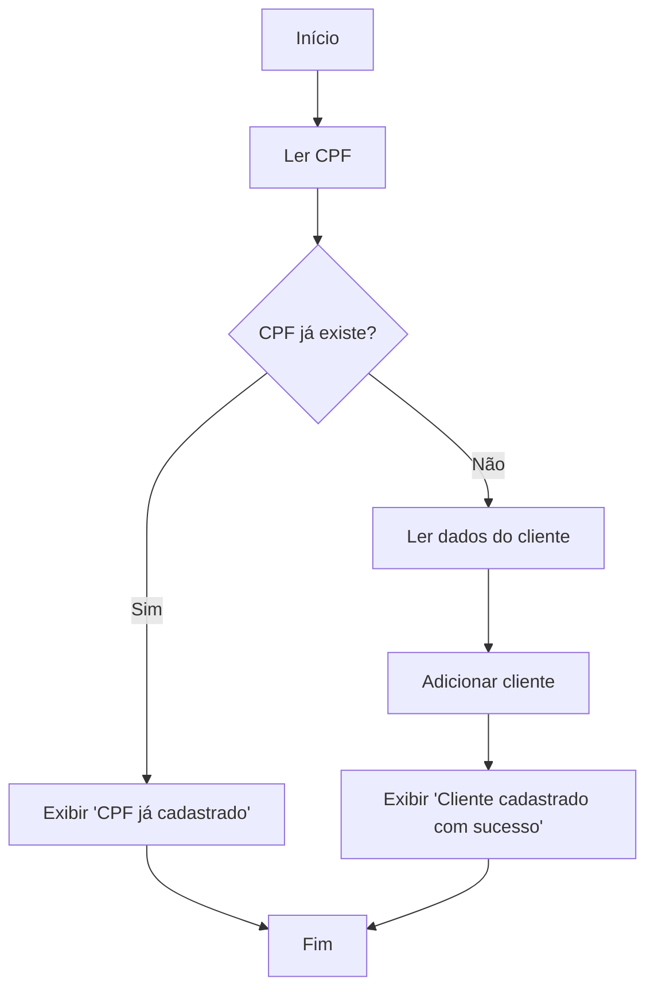
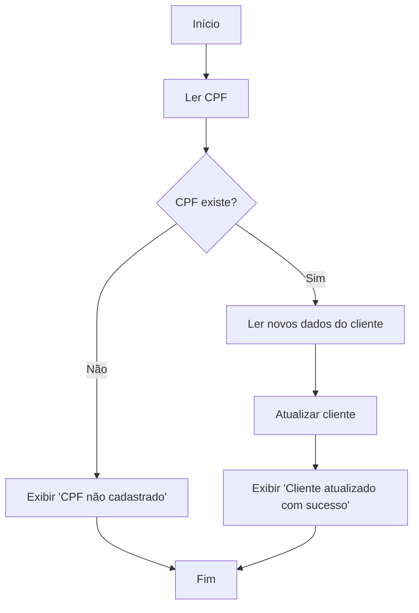
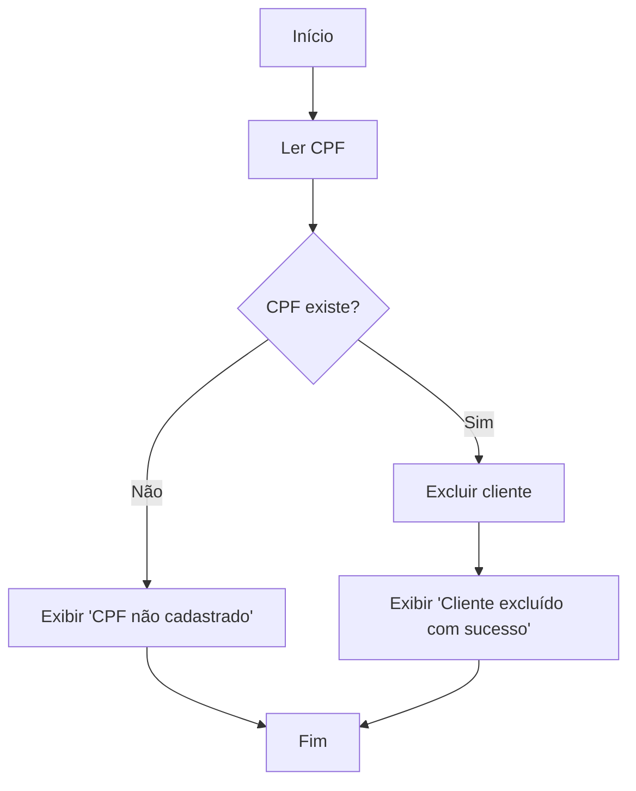
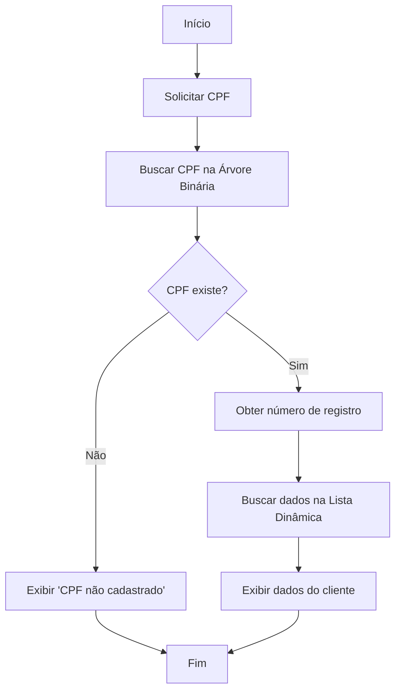
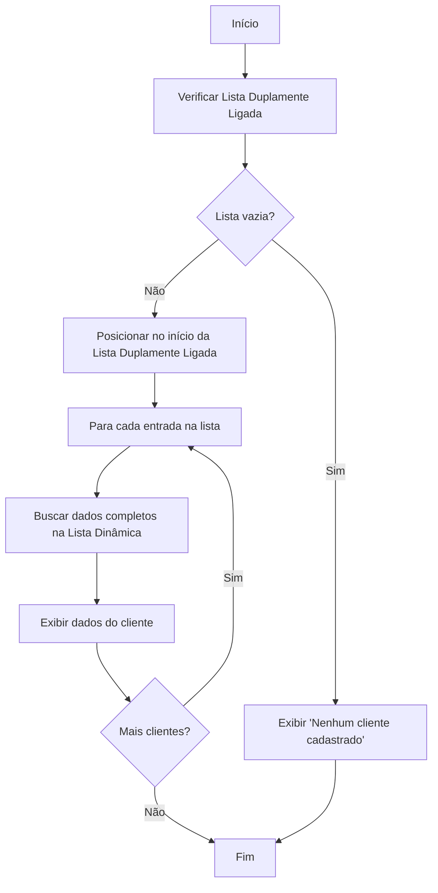

# Diagramas de Atividades - Simulador de Cadastro de Clientes

## Adicionar Cliente

```mermaid
flowchart TD
    A[Início] --> B[Ler CPF]
    B --> C{CPF já existe?}
    C -->|Sim| E[Exibir 'CPF já cadastrado']
    E --> Z[Fim]
    C -->|Não| F[Ler dados do cliente]
    F --> G[Adicionar cliente]
    G --> H[Exibir 'Cliente cadastrado com sucesso']
    H --> Z

```

## Alterar Cliente

```mermaid
flowchart TD
    A[Início] --> B[Ler CPF]
    B --> C{CPF existe?}
    C -->|Não| E[Exibir 'CPF não cadastrado']
    E --> Z[Fim]
    C -->|Sim| F[Ler novos dados do cliente]
    F --> G[Atualizar cliente]
    G --> H[Exibir 'Cliente atualizado com sucesso']
    H --> Z
```

## Excluir Cliente

```mermaid
flowchart TD
A[Início] --> B[Ler CPF]
B --> C{CPF existe?}
C -->|Não| E[Exibir 'CPF não cadastrado']
E --> Z[Fim]
C -->|Sim| F[Excluir cliente]
F --> G[Exibir 'Cliente excluído com sucesso']
G --> Z
```

## Procurar Cliente

```mermaid
flowchart TD
    A[Início] --> B[Solicitar CPF]
    B --> C[Buscar CPF na Árvore Binária]
    C --> D{CPF existe?}
    D -->|Não| E[Exibir 'CPF não cadastrado']
    D -->|Sim| F[Obter número de registro]
    F --> G[Buscar dados na Lista Dinâmica]
    G --> H[Exibir dados do cliente]
    E --> I[Fim]
    H --> I
```

## Gerar Relatório

```mermaid
flowchart TD
    A[Início] --> B[Verificar Lista Duplamente Ligada]
    B --> C{Lista vazia?}
    C -->|Sim| D[Exibir 'Nenhum cliente cadastrado']
    C -->|Não| E[Posicionar no início da Lista Duplamente Ligada]
    E --> F[Para cada entrada na lista]
    F --> G[Buscar dados completos na Lista Dinâmica]
    G --> H[Exibir dados do cliente]
    H --> I{Mais clientes?}
    I -->|Sim| F
    I -->|Não| J[Fim]
    D --> J
```
