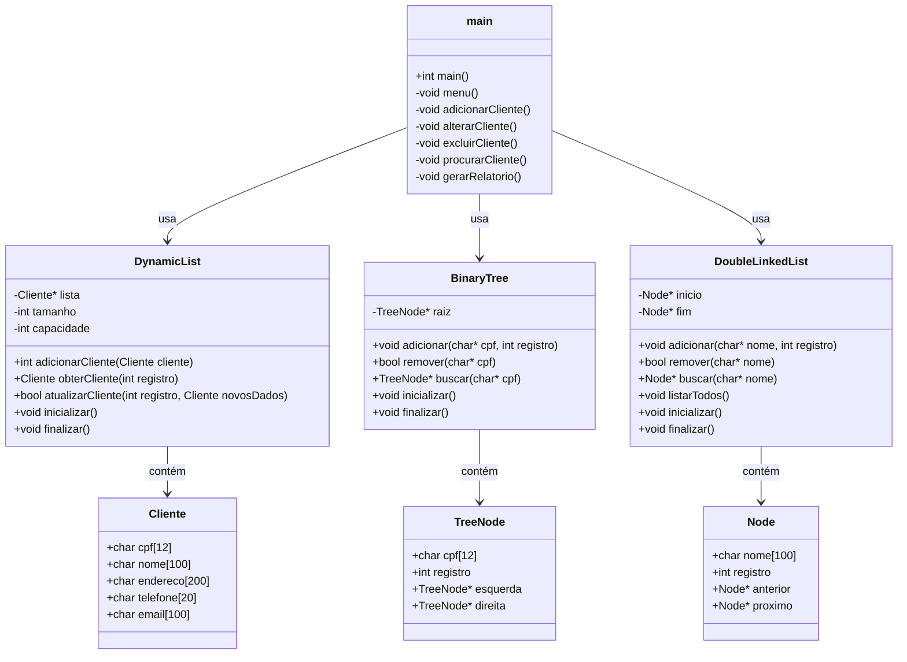
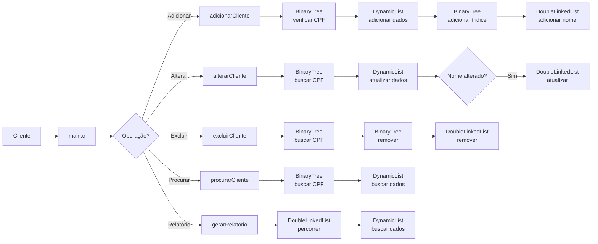

# Diagrama de Módulos - Simulador de Cadastro de Clientes

Este diagrama apresenta a estrutura modular do sistema e como os diferentes componentes se relacionam.

## Diagrama de Componentes

## Fluxo de Dados Principais

## Descrição dos Módulos

### 1. Módulo Principal (main.c)

Responsável pela interface com o usuário, menu e coordenação entre os módulos.

### 2. Módulo de Lista Dinâmica (dynamicList)

Gerencia o armazenamento dos dados completos dos clientes.

### 3. Módulo de Lista Duplamente Ligada (doubleLinkedList)

Mantém um índice ordenado por nome para facilitar a geração de relatórios.

### 4. Módulo de Árvore Binária (binaryTree)

Implementa a indexação por CPF para acesso rápido aos registros.
